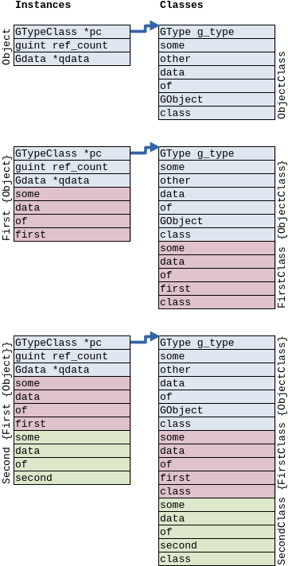
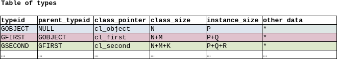

## Create and run your first object.

Source code for this chapter is in [/src/gobj-02/](../src/gobj-02/) directory.

### Conventional module and object names

In this tutorial we will use follwing names:

- short module name "tut"
- object name "obj02" (named after chapter number)

Conventional rules for naming objects:

- structures and types named TutObj02 (CamelCase ModuleType convention)
- macros use module TUT and type OBJ02 parts (all-capital convention)
- functions named tut_obj02_function_name (snake_case module_type_function convention)

### Standard definitions

To implement new object we should declare

- an autoregistering macro for new type TUT_TYPE_OBJ02
- a structure for class data
- a structure for instance data

```C
#include <glib-object.h>

#define TUT_TYPE_OBJ02 (tut_obj02_get_type())

/* Simple type with non-virtual method 'whoami(void)' -- minimalistic */

/* BEGIN HEADER */

typedef struct _TutObj02Class TutObj02Class;

struct _TutObj02Class
{
    GObjectClass parent_class;
};

typedef struct _TutObj02 TutObj02;

struct _TutObj02
{
    GObject parent_instance;
};
```

Note that `struct _TutObj02 ...` and `typedef ... TutObj02` pairs. It is naming convention too.
Macros provided in library headers do the same.

Class structure of TutObj02 named TutObj02Class. It contains standard member 'parent_class' at 
the very beginning. This means that any pointer to this class structure is effectively pointer
to class structure of parent class too. The same with instance structure, having standard member
'parent_instance'. This property of both structures defined that way is actually used by
library.

<a name="memory-structure-and-init"></a>
Consider following memory layout for simple system of objects, derived objects and "derived from
derived objects":



Consider library maintans a following table of types somewhere inside:



Any pointer to any of the instances is a pointer to GObject instance, located at the beginning
of instances's memory block. First field in GObject instance is a pointer to *some* class
structure. So, the library can find "details of class implementation" for any instance, given
the pointer to that instance. Particularly, for any registered type library knows memory sizes
of instance and class structures, and allocates memory blocks of appropriate size.

Similar, any pointer to a class structure is a pointer to GObjectClass structure, located at
the beginning of class structure's memory block. First field of GObjectClass structure is a
type identifier. So, the library can find detailed type description for any instances of
*some* class.

Why *some*? Part of class and instance initialization is made inside the library. When memory
structure of derived class is created, library automatically copies the contents of parent's
class structure to a beginning of derived's class structure. Then, value of type identifier
field `g_type` is automatically *replaced* by value of a derived class type.

Similar, when memory structure of derived class' instance is created, library automatically
fills the contents of a parent class' instance, embedded into derived class' instance. Parent
class structure holds pinters to special `xxx_init ()` functions for that. Value of pointer
to class structure `pc` is automatically changed to pointer to derived class structure.

After that, library calls corresponding `xxx_init ()` functions, provided by derived class
implementation. These functions may make necessary changes in (already partially initialized)
memory structures.

That is how instantiation of class and object of a class made.

### API definitions for object type

There are three functions:

- `tut_obj02_get_type ()` to register type and return it to caller
- `tut_obj02_new ()` to create new instance of object
- `tut_obj02_whoami ()` as the only "application logic" method of object

```C
GType
tut_obj02_get_type (void);

TutObj02 *
tut_obj02_new (void);

void
tut_obj02_whoami (const TutObj02 *self);

/* END HEADER */
```

### API implementation -- registering type

All that library need to know is:

- a parent class of new object
- a size of class structure for new object class
- a size of sigle instance of new object class
- how to initialize class data in new object class
- how to initialize data in dynamically created instance

```C
/* BEGIN IMPL */

static void tut_obj02_class_init (TutObj02Class *klass); /* "standard  method" for class initialization */
static void tut_obj02_init (TutObj02 *self);             /* "standard  method" for instance initialization */

GType
tut_obj02_get_type (void)
{
    static GType type = 0;

    if (type == 0) /* tupe registered once on demand */
    {
        const GTypeInfo ti =
            {
                .class_size     = sizeof (TutObj02Class),
                .base_init      = NULL,
                .base_finalize  = NULL,
                .class_init     = (GClassInitFunc) tut_obj02_class_init,
                .class_finalize = NULL,
                .class_data     = NULL,
                .instance_size  = sizeof (TutObj02),
                .n_preallocs    = 0,
                .instance_init  = (GInstanceInitFunc) tut_obj02_init,
                .value_table    = NULL
            };
        g_print ("entered tut_obj02_get_type()\n\tRegistering new static type\n");
        type = g_type_register_static (G_TYPE_OBJECT, "TutObj02", &ti, G_TYPE_FLAG_FINAL);
    }
    return type;
}
```

Required information passed to library in GTypeInfo structure and parent_type parameter of
registration function. Most fields of GTypeInfo left NULL. There are good defaults for simple
objects, such as TutObj02.

Type identifier returned from `g_type_register_static ()` is cached in static variable inside
our `tut_obj02_get_type ()` function and reused in next calls.

### API implementation -- class and instance initialization

Our object does not contain any data, have no differences from GObject in class data, so
initialization functions are effectively empty. When allocating memory for class structure
and instance, library automatically filled its "standard" members, located at beginning. Library
already knows about parent type, and how to initialize its class structure and instances, as
described [above](#memory-structure-and-init).

```C
static void
tut_obj02_class_init (TutObj02Class *klass) {
    g_print ("entered tut_obj02_class_init()\n");
    (void)klass;
}

static void
tut_obj02_init (TutObj02 *self) {
    g_print ("entered tut_obj02_init()\n");
    (void)self;
}
```

### API implementation -- method for instance creation

Provided all of the above, it is already possible to create out TutObj02, using default API:

```C
    TutObj02 *instance = g_object_new(TUT_TYPE_OBJ02, NULL);
```

But it is usual for library autor to provide library users with properly named method of creation:

```C
TutObj02 *
tut_obj02_new (void) {
    g_print ("entered tut_obj02_new()\n");
    return (TutObj02 *) g_object_new (TUT_TYPE_OBJ02, NULL);
}
```

### API implementation -- application method of object

The only application method of our TutObj02 is to report itself:

```C
void
tut_obj02_whoami (const TutObj02 *self)
{
    g_print ("entered tut_obj02_whoami()\n\tI am TutObj02! (maybe)\n");
    (void)self;
}

/* END IMPL */
```

### Creating and using object

```C
int
main (void)
{
    TutObj02 *obj;
    GTypeQuery tq;

    /* create our object */
    obj = tut_obj02_new ();

    /* some info on our object */
    g_print ("obj -> %p\n", obj);
    g_print ("G_IS_OBJECT(obj) = %d\n", G_IS_OBJECT (obj));
    g_type_query (TUT_TYPE_OBJ02, &tq);
    g_print ("Type query:\n");
    g_print ("\ttype = 0x%lX\n", tq.type);
    g_print ("\ttype_name = %s\n", tq.type_name);
    g_print ("\tclass_size = %u\n", tq.class_size);
    g_print ("\tinstance_size = %u\n", tq.instance_size);

    /* use public interface to our object */
    tut_obj02_whoami(obj);

    /* delete our object */
    g_print ("before unref: obj->ref_count = %d\n", G_OBJECT (obj)->ref_count);
    g_clear_object (&obj);

    return 0;
}
```

Line `obj = tut_obj02_new ();` creates new instance with reference count 1. Line
`g_print ("G_IS_OBJECT(obj) = %d\n", G_IS_OBJECT (obj));` makes us sure that it is object indeed.
Type query shows, that class and instance of TutObj02 is almost the same as corresponding class
and instance of GObject. We haven't added anything to GObject class.

The only difference in API is new application method that we can call with instance of TutObj02
as in line `tut_obj02_whoami(obj);`.

Destruction of object is usual, there is no need to free any resources inside of instance.
